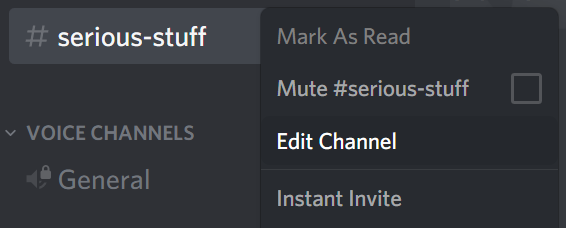
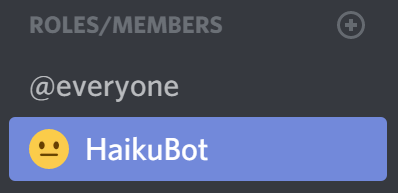
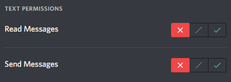

# HaikuBot

    

        
.

        
Haikus found

    

    

        
.

        
Servers

    

HaikuBot is a friend-shaped Discord bot that detects accidental (or intentional) messages in your Discord server that can be turned into a 5-7-5 haiku, and then shows the message in haiku format. It uses a combination algorithms and a syllable dictionary to try to be accurate (although it still sometimes makes mistakes).

HaikuBot has a few fun tricks and secrets, but mostly stays out of the way unless you interact with it or it detects a haiku. If you have any questions, problems, and suggestions for the bot, or you just want to say hi, come join the [Official HaikuBot Discord Server](https://discord.gg/Cm5v93M).

    <a class="button button-discord" href="https://discordbots.org/bot/372175794895585280">
        View on Discord Bot List
    </a>
    <a class="button" href="https://discordapp.com/oauth2/authorize?client_id=372175794895585280&scope=bot&permissions=19520">
        Invite to Server
    </a>

## Restricting HaikuBot

Sometimes, there are channels where you don't want HaikuBot. Luckily, Discord allows you to restrict where users (and bots) can and can't speak.

- First, right-click the channel you want HaikuBot to ignore, and select 'Edit Channel'.

- Under the Roles/Members section of the 'Permissions' panel, add a new role for HaikuBot.

- Remove the 'Read Messages' and 'Send Messages' permissions for HaikuBot for this channel.

That's it! HaikuBot should now ignore any messages in this channel. Make sure that HaikuBot and any of its roles don't have the 'Administrator' permission, as this overrides any channel-specific permissions. Bleep bloop!

    <a class="button button-haiku" href="https://discord.gg/Cm5v93M">
        Join Official Server
    </a>
    <a class="button" href="/">
        Back to Homepage
    </a>

